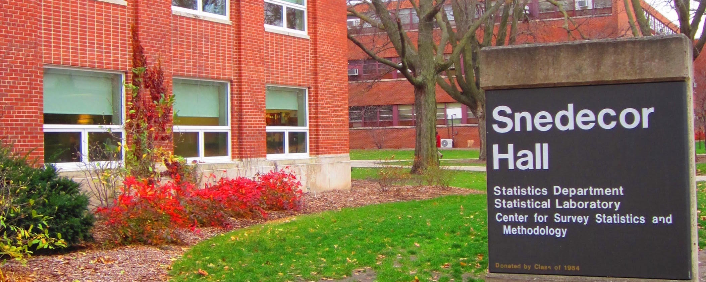
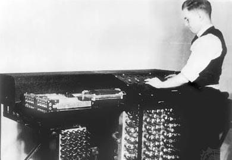
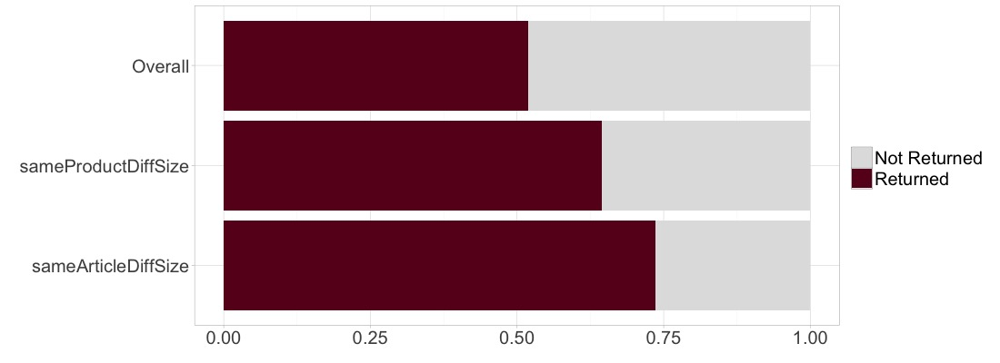
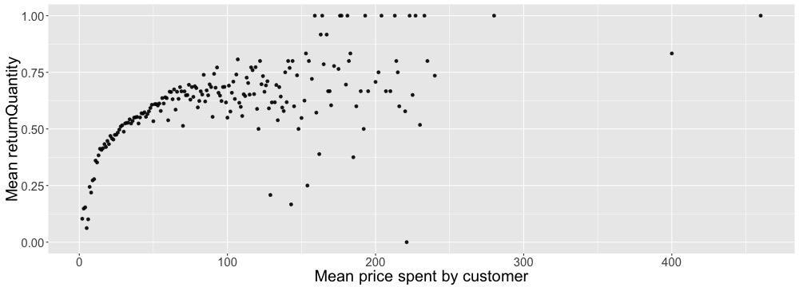
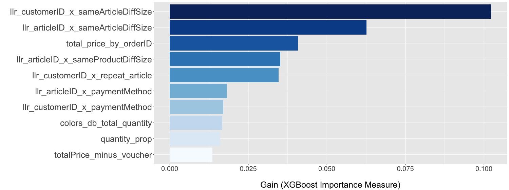
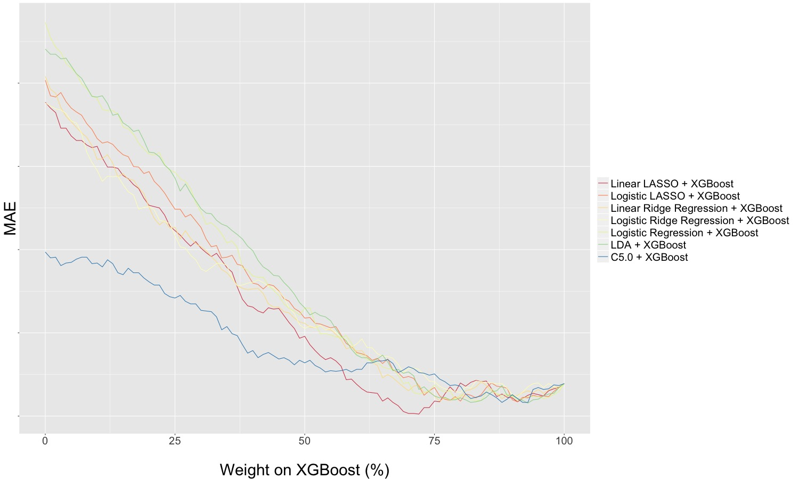
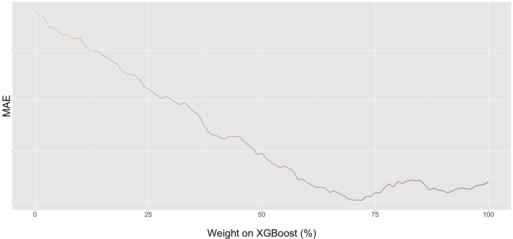

# Introduction 

## Iowa State University

- Located in Ames, Iowa, USA
- Statistics Department founded by George W. Snedecor in 1947  -- First Stats Dept. in USA!
- ISU also developed first automatic electronic digital computer in 1937: Atanasoff–Berry computer (ABC)

---

# Introduction 

## Iowa State University

Clifford Berry with the Atanasoff–Berry computer (1941)

# Introduction

## Team Members 

---

# Approach

- Objective: Use data over 21 month period to predict return quantities for the following 3 months 
- Treated return quantity as binary since only 0.17% of return quantities were greater than 1
- Split available 21 month data into 3 disjoint sets: historical set, training set, and test set 
- Searched for patterns in the historical set
      - patterns will help map known return behaviour to unknown return behaviour
- Created features (or variables) according to these patterns for the feature matrix

---

# Feature Generation - Order Type

- Created features based on order type
- Classified order type by defining properties: discount, voucher amount, variability, quantity, price, date of purchase, etc of order

## Notable features related to order type

---

# Feature Generation - Customer Type

- Created features based on customer behaviour
- Classified customer behaviour by defining properties: frequency of visit, time between visits, amount spent, quantity purchased, etc

## Notable feature related to customer behaviour 

---

# Feature Generation - Item Type 

- Created features based on item type
- Issue: new items introduced in classification set
    - 20% new color codes
    - 18.4% new product groups
    - 75.5% new voucherIDs 
- Solution:
    - classified item type by defining properties 
    - standardized sizes
    - mapped new products to existing products
    - mapped new colors to existing colors 
    
---

# Product Group Conversion 

- 13 new product groups introduced in classification set
- No information about these new products in historical set 
- Merged new product groups with existing groups based on similarities

---

# Color Code Conversion

- Historical set contained only 4-digit color codes 
- Classification set contained both 4-digit and 5-digit color codes 
- 86 new color codes in classification set have no overlap with historical set
- Possible that last 3 digits of color code represent 3-digit RGB color code
- Extracted last 3 digits of color code to create new color feature

---

# Feature Matrix 

- Including interaction terms between variables, complete feature matrix had 1,539 features
- Used feature selection to reduce size to 500 of the most important features

## Top 10 most important features for xgboost 

# Models

- Tried various modeling techniques
- Minimum MAE between return quantity and predicted return quantity in test set dictated best model. 
- XGBoost (tree-based model) performed the best among all models
- Combining XGBoost with another model can further improve predictions by adding information that XGBoost may have missed.
\begin{table}
\begin{tabular}{ c | c }
XGBoost & Linear LASSO\\ 
Random forest & Logistic LASSO\\ 
C5.0 & Linear Ridge Regression \\ 
extraTrees & Logistic Ridge Regression \\ 
~ & Logistic Regression \\ 
~ & LDA \\ 
\end{tabular}
\end{table}

# Combining Models

## Combinations of xgboost with various models

---

# Final Model

- Final model: 70/30 combination of XGBoost and Linear LASSO trained on the final training set.

## Combination of xgboost & linear lasso in test 

---
# Acknowledgements

> A special thanks to prudsys for this wonderful opportunity and invitation to Berlin, and to Iowa State University for supporting us!  

