# Geography Quiz

---

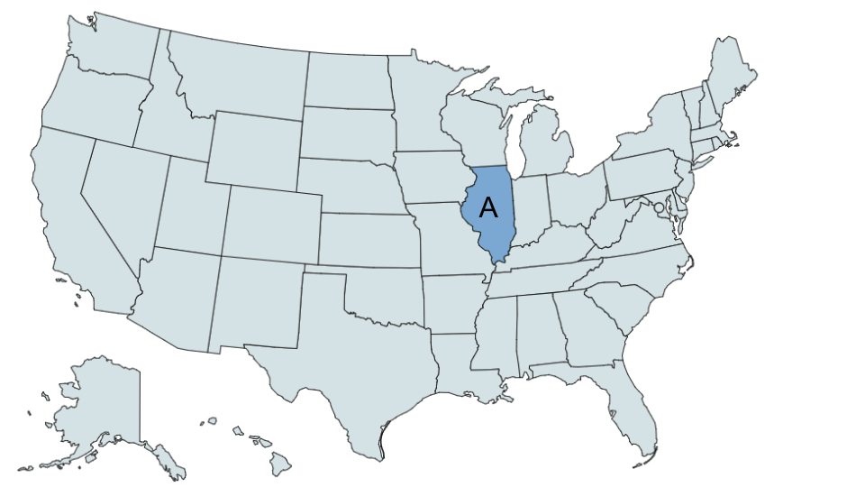

---

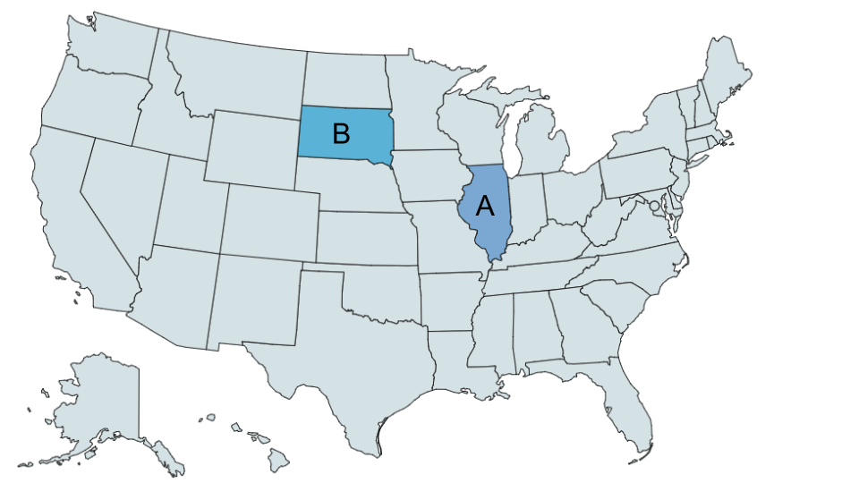

---

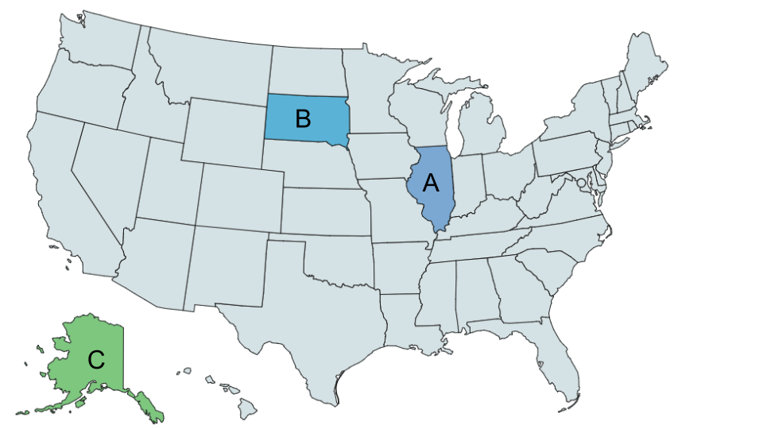

---

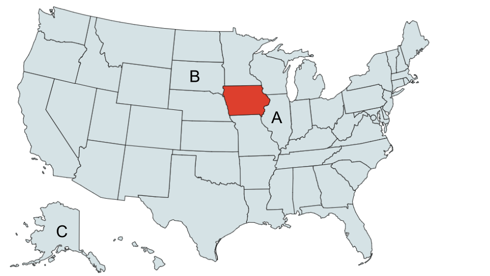


## What we used

R and Python modules - size weighted by # of occurences in code

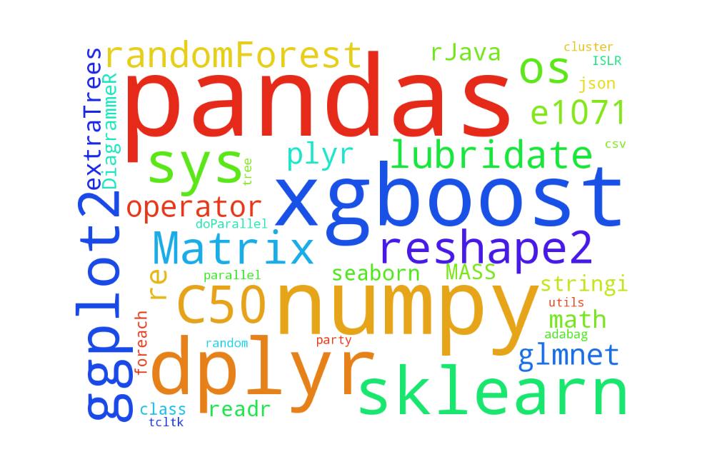


# Feature Engineering 

## Numerical features

- Clustering customers by their behavior such as:
    - The frequency of their visits and time in between visits 
    - The quantities that they buy in
    - The variability of the goods they buy in terms of sizes, colors, product groups, etc.
- Standardizing size, price, and other variables within product groups
- When all else failed we simply took differences, products, and quotients of existing features to
  account for interactions

## Categorical features 

- Need to map categorical variables to numerical variables in a meaningful way
- One-hot encoding (indicator variables) is one option, but this greatly increases the number of features
    - If one categorical variable has 800 levels, then 800 new columns will have to be made
    - If you want to include an interaction with another categorical variable that has 50 levels, then 800 x 50 = 40000 new variables will have to be made
- Even though tree-based methods are designed to ignore useless features, in practice they can be cumbersome

## Alternative to one-hot encoding

- Map categorical features to meaningful numeric features using the response variable (returnQuantity)
- To prevent leaking information from returnQuantity into training set and test set, we build these features based on a 
  historical set which is disjoint from any data we train on

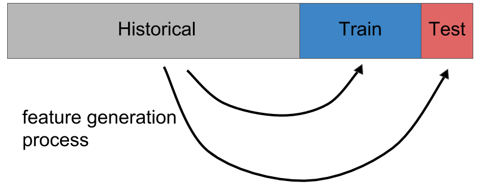

## Example with sizeCode

- For each row with sizeCode = S, the new variable is created like so:

$$\text{S} \mapsto \log \frac{\text{(\# rows with sizeCode = S and Y $\geq$ 1)} + \epsilon_{1}}{\text{(\# rows with sizeCode = S and Y = 0)} + \epsilon_{0}}$$

- $\epsilon_{1}$ and $\epsilon_{0}$ are chosen in a Bayesian way to reflect prior information and to add numerical stability

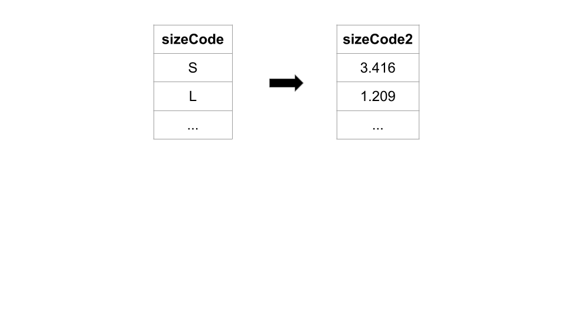

# Feature Matrices

## Dealing with seasonality

```{r echo=F}
# 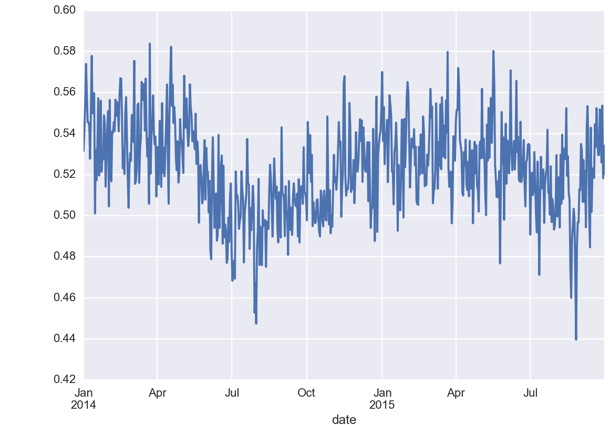
library(ggplot2)
dat = read.csv('../../users/epwalsh/by_day.csv')
dat$date <- as.Date(dat$date)
ggplot(data=dat, aes(x=date, y=returnQuantity)) + geom_line(alpha=I(0.5)) +
  ylab("Mean return quantity") + xlab("") +
  scale_x_date(labels=function(x) format(x, "%b %Y")) + stat_smooth(method="loess")
```


## Version 5(d)

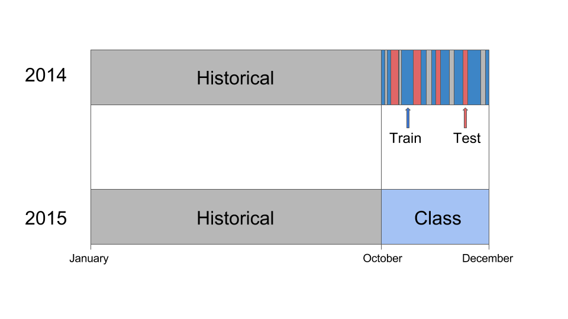


## Version 5(d) Final

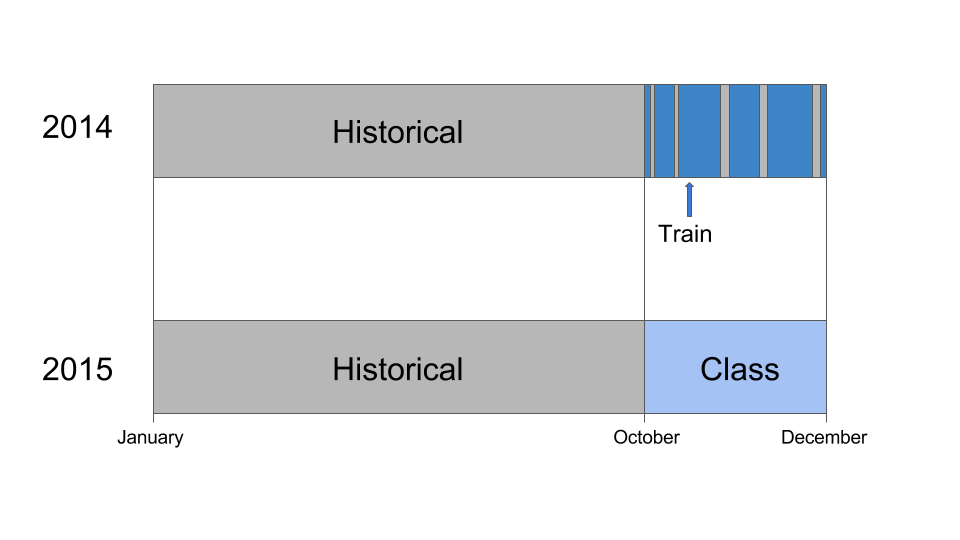


## Version 6

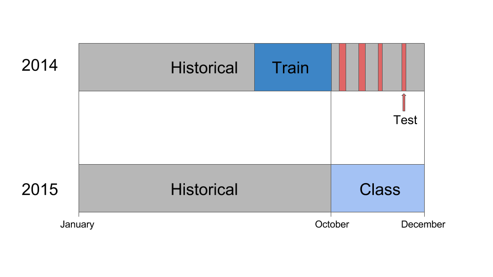


## Version 6 Final

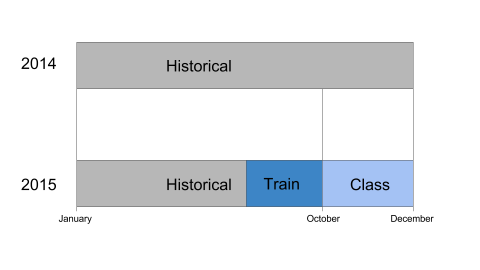


# Final Model

## Xgboost outperformed all

- We found that training a tree-based xgboost model with a binary classification objective
  produced the best mean absolute error (MAE)
- We primarily focused on tuning 3 parameters:
    - **eta:** the learning rate for boosting
    - **max_depth:** the maximum depth of each tree
    - **colsample_bytree:** the number of features to randomly choose for determining each split
- Xgboost performed so well that combining anything and everthing else with xgboost could not improve the MAE

## Ensembling

- Ultimately the best ensemble of models was a combination of two xgboost models:
    - 45% xgboost trained on feature matrix version 5(d)
    - 55% xgboost trained on feature matrix version 6

```{r echo=F, fig.height=4}
# 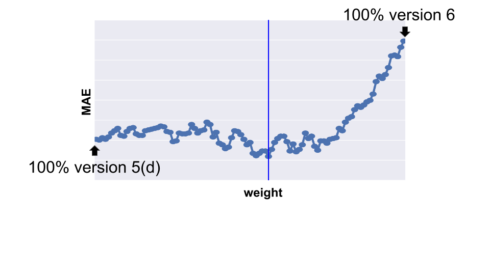
dat2 = read.csv('../../data/predictions/team2_final.csv')
qplot(data=dat2, x=theta, y=mae, geom="line", color=theta) + 
  theme(axis.text.y=element_blank(), axis.ticks.y=element_blank(), legend.position="none") +
  ylab("Test MAE") + xlab("Weight on version 6")
```

---

- While combining these models only improved MAE slightly, there was another motivation for doing it this way...
- Neither feature matrix was perfect:
    - A model trained on version 5(d) would be training on data one year in the past, not the most recent data, which could add bias
    - For version 6, the final training set had to be completely different from the initial training set, which was one year in the past
    - Since the parameters for our model were mostly tuned using the initial training set, this could hurt the final model if the optimal parameters changed from year-to-year
- Combining results from both feature matrices provided a way of hedging our bet in case one of the feature matrices was biased

## Thank you for listening!

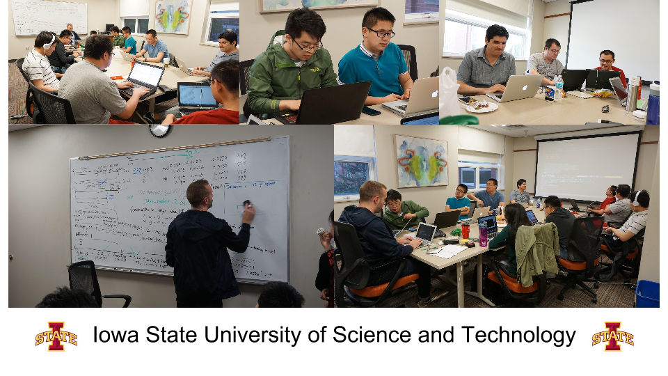
